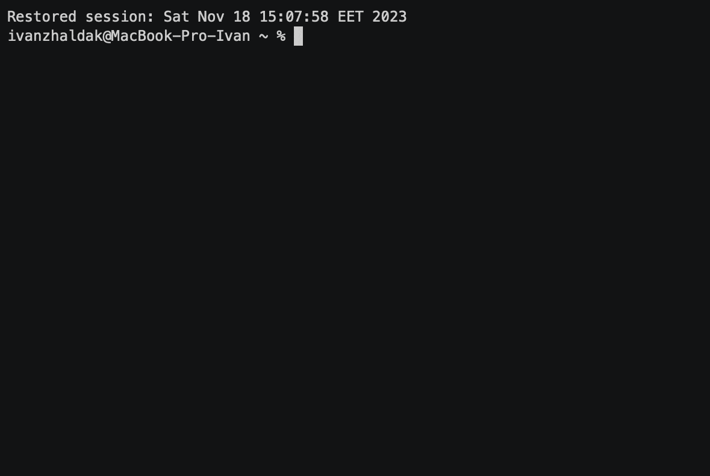

# AsciiArtify
Порівняння k8s інструментів

## Вступ
Існує кілька інструментів для розгортання Kubernetes кластерів в локальному середовищі, таких як Minikube, Kind та K3d. У даному порівняльному аналізі ми розглянемо їхні основні характеристики, переваги та недоліки, а також виконаємо коротку демонстрацію застосування кожного інструменту.

Характеристики
1. Minikube
Підтримувані ОС та архітектури: Linux, macOS, Windows; AMD64, ARM, ARM64.
Можливість автоматизації: Повністю автоматизований.
Додаткові функції: Включає в себе такі функції, як оновлення Kubernetes та додаткові аддони.
2. Kind (Kubernetes in Docker)
Підтримувані ОС та архітектури: Linux, macOS, Windows; AMD64, ARM64 (експериментально).
Можливість автоматизації: Спрощена автоматизація порівняно з Minikube.
Додаткові функції: Надає можливість використовувати свої Docker імеджі для нод кластера.
3. K3d
Підтримувані ОС та архітектури: Linux, macOS, Windows; AMD64.
Можливість автоматизації: Легко автоматизований інструмент.
Додаткові функції: Інтегрується зі зберіганням в облаках, надає можливість налаштовувати мережі та використовувати Helm.
### Переваги та Недоліки
Minikube

Переваги: Стабільність та широке сприйняття в спільноті.
Вбудована підтримка для оновлення Kubernetes та аддонів.
Недоліки: Часом повільне встановлення та оновлення.

Kind
Переваги: Швидкість розгортання через використання Docker для нод.
Проста налаштовуваність.
Недоліки: Обмежена підтримка архітектур, особливо на ARM.

K3d
Переваги: Швидке розгортання та легка автоматизація.
Підтримка облакових зберігань та Helm.
Недоліки: Залежність від Docker.

| Характеристика                     | Minikube                                  | Kind                                         | K3d                                          |
|----------------------------------  |-------------------------------------------|----------------------------------------------|----------------------------------------------|
| **Підтримувані ОС та архітектури** | Linux, macOS, Windows; AMD64, ARM, ARM64  | Linux, macOS, Windows; AMD64, ARM64 (експ.)  | Linux, macOS, Windows; AMD64                 |
| **Можливість автоматизації**       | Повністю автоматизований                  | Спрощена автоматизація порівняно з Minikube  | Легко автоматизований                        |
| **Додаткові функції**              | Включає оновлення Kubernetes та аддони    | Використовує свої Docker імеджі для нод      | Інтегрується зі зберіганням в облаках, Helm  |
| **Переваги**                       | Стабільність, широке сприйняття           | Швидке розгортання, проста налаштовуваність  | Швидке розгортання, легка автоматизація      |
| **Недоліки**                       | Повільне встановлення та оновлення        | Обмежена підтримка архітектур, особливо ARM  | Залежність від Docker                        |

## Демонстрація:
* Minicude

* Kind

* K3d

## Висновки

### Minikube
Minikube виявився легким у використанні та швидким у розгортанні ізольованих Kubernetes кластерів для локальної розробки та тестування. Його переваги включають широку підтримку ОС, можливість автоматизації через командний рядок та відносну легкість у використанні. Однак, для продукційного середовища, де необхідно розгортати більш складні кластери, Minikube може бути недостатньо потужним.

### Kind (Kubernetes in Docker)
Kind надає зручний спосіб створення Kubernetes кластерів, використовуючи Docker контейнери для вузлів кластера. Його переваги включають швидкість розгортання та можливість тестування різних версій Kubernetes. Kind є ефективним інструментом для локального розробника або тестера, але йому може бракувати деяких функцій для продукційного використання, таких як масштабованість та підтримка деяких додаткових функцій Kubernetes.

### k3d
k3d, як і Kind, використовує Docker для створення локальних Kubernetes кластерів. Його переваги включають можливість створення багатокластерних середовищ та автоматизоване використання Helm для додаткового розгортання застосунків. k3d є добрим вибором для локального тестування та розробки.

### Рекомендації
1. **Minikube:**
   - Рекомендується для початківців та тих, хто шукає швидкий спосіб запустити Kubernetes локально.
   - Підходить для невеликих проектів та експериментів.

2. **Kind:**
   - Ідеально підходить для розробників, які шукають швидкий спосіб тестування та вивчати Kubernetes.
   - Добре підходить для тестування різних версій Kubernetes та компонентів.

3. **k3d:**
   - Рекомендується для тих, хто шукає легку та ефективну альтернативу для локального розгортання Kubernetes кластерів.
   - Додатковий бонус - можливість створення багатокластерних середовищ.

### Загальні висновки
Вибір інструменту залежить від конкретних потреб та завдань. Minikube підходить для швидкого початку, Kind - для легкого тестування, а k3d - для використання в середовищі розробки та тестування. Розгляньте конкретні вимоги вашого проекту та виберіть інструмент, який найкраще відповідає вашим потребам.

